[pickit table of content](https://github.com/blizzhackers/pickits/#pickits)

----

# Nipper

---

by [@frickaline](https://github.com/frickaline)

### What is Nipper?
Nipper is a Java Application that provides a graphical user interface (GUI) for editing NIP files. NIP files, also known as pickit or snagit files, contain individual lines that characterize the items you want your bot to retain. Changing these lines changes the items the bot picks up, sells, and retains.

The syntax of these NIP files can be cumbersome and/or complicated. The Nipper GUI gives users the ability to click on valid keywords to construct NIP lines that are always valid syntactically. It also provides NIP checking for any NIP files that were written outside the GUI.

Note that you cannot create an invalid NIP line in Nipper. You can create NIPs that don't keep what you intend, but the syntax will always be valid.

### Installation

The Oracle Java Runtime Environment is required to run Nipper. If you have the JRE installed, you can simply double click on Nipper.jar to run the application. Otherwise, you could open nipper using windows command prompt, adding the corect path for app:

```
C:\>java -jar X:\...\Nipper\nipper.jar
```

If you don't have the Java runtime environment installed, you will have to install it to use Nipper. Please visit [Oracle](https://www.java.com/en/download/manual.jsp) to download and install the latest JRE. Note that Nipper is a 32 bit application so regardless of your OS version, you need the [x86 JRE](http://javadl.oracle.com/webapps/download/AutoDL?BundleId=220313_d54c1d3a095b4ff2b6607d096fa80163). If you have also the x64 version installed you can create a bat file to force it to run with the 32 bit JRE, just put this line in a text document and save it as niprunner.bat then use that file to run nipper:
```
"C:\Program Files (x86)\Java\jre1.8.0_191\bin\java.exe" -jar nipper.jar
```
jre1.8.0_191 <-- needs to be changed after every java update, according to the new java version.

### Usage

#### File Menu

When you first launch Nipper, the UI will appear like the first image in the gallery below.
Select the file menu as shown and either edit an existing NIP file or create a new NIP file to work with.

* File -> New
The second image below shows the UI as it appears after creating a new NIP file. There will exist only 1 section header named "New Section Header" and no items. The section header can be renamed through the right click menu. New items can be added with the right click menu as well.

* File -> Open
In this example, we are opening the NIP file Etal\scripts\NTBot\item_configs\Master\Fast.nip. When the load completes, the Nipper UI displays as the third image in the UI.
You will see only the unexpanded section headers which contain all your items. Expand a section of the tree so you can see the individual items associated with a section header.

* File -> Save/Save As
Save your current NIP file to the existing filename or use a new filename when using the "Save As" selection.

* File -> Exit
Exit the Nipper application.

* default UI

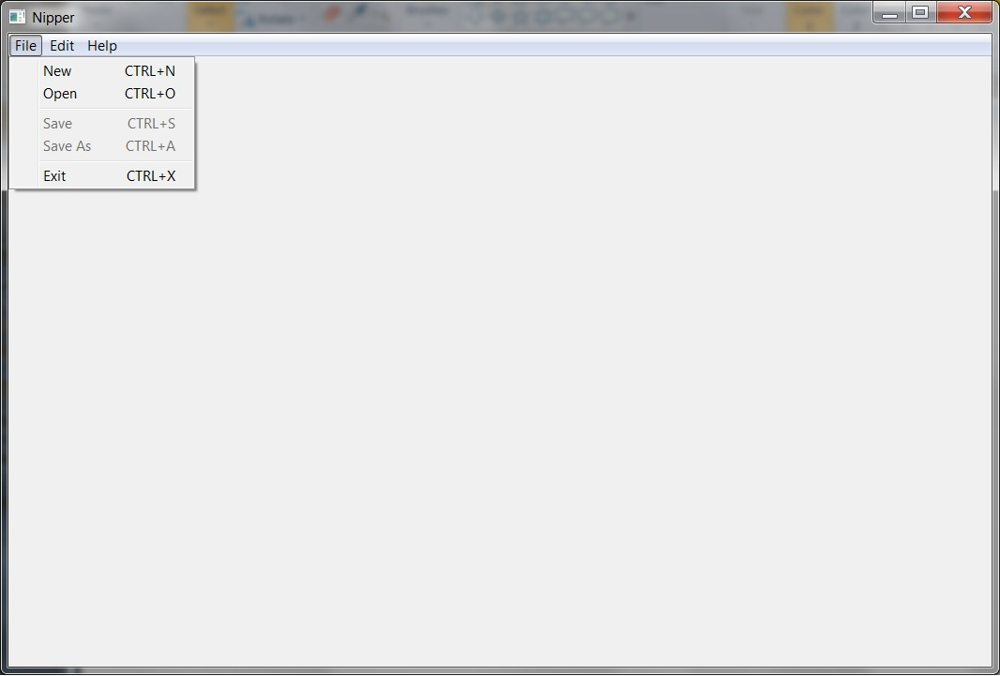

* new UI


* open UI

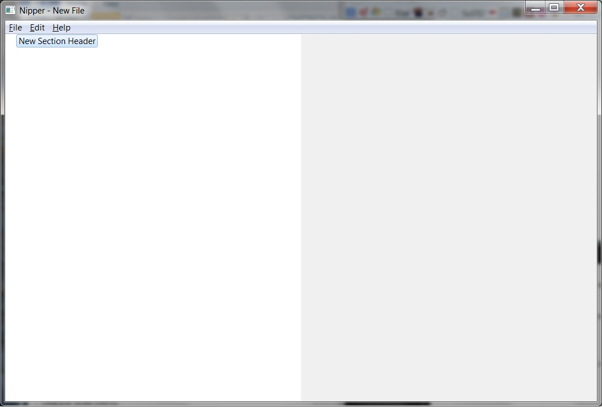

* section headers

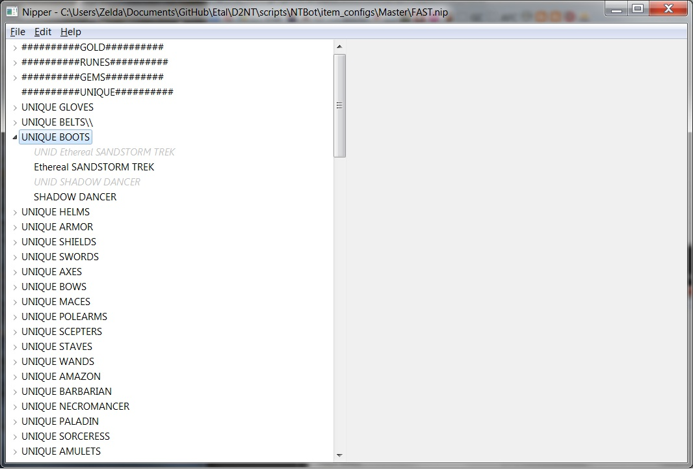

#### Right-click Menu

Right-click Menu -> Enable/Disable
Items that are greyed out and italicized are disabled item entries. They are considered "commented out" and are inactive. Items in regular text are enabled. To switch an item between enabled and disabled, right click the item and select the disable/enable option.

Right-click Menu -> New Section
Use this option to create a new section header under which to group your items.

Right-click Menu -> New Item
Use this option to create a new item (or NIP line) which describes an item you want the bot to retain.

Right-click Menu -> Copy
Use this option to copy an existing section header or item to the paste buffer.

Right-click Menu -> Paste
Use this option to paste the copied section header or item into the UI at the selected location within the file.

Right-click Menu -> Rename
Use this option to rename an existing section or item.

Right-click Menu -> Delete
Use this option to delete an existing section or item.

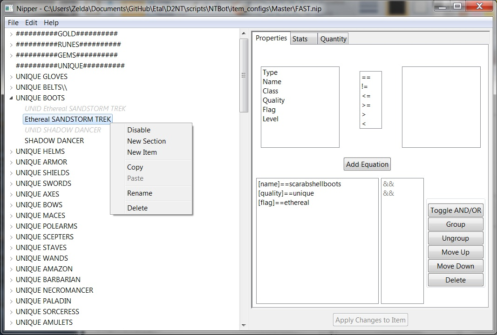

#### Editing the contents of an item in the right-hand pane

The right hand pane will be blank whenever you have a header selected in the left hand pane but will contain a tabular interface whenever an item is selected in the left hand pane. The tabular interface is made up of 3 tabs: Properties, Stats, and Quantity.[/INDENT]

###### The Properties Tab

The properties tab contains all item properties associated with your item. The valid properties of an item consist of Type, Name, Class, Quality, Flag, and Level.

When you select a property, the right hand window will fill up with all valid selections for that specific property.

Select your desired comparative and value. Hit the Add equation button to add that property to the list of properties you will look for.

Add more properties until your item is fully described. When selecting certain properties the list of possible values might be rather long. In those cases, a new box containing the text "<enter filter>" will appear just above the list of values.

Use this field to restrict the contents of the value field to only those you wish to see.

Make your selections an add the equation to your list. The logic will assume you mean to "AND" your 2 equations together. In other words, Nipper in this example assumes you mean to look for items with a quality equal/less than superior AND named "crystalsword".

If you wish that logic to be OR'ed instead, use the Toggle AND/OR button. If you desire groupings to describe and order of operations to your logic (i.e. parantheticals) use the Group/Ungroup buttons. You can also move equations up and down in the list or delete them altogether.

* Default selection

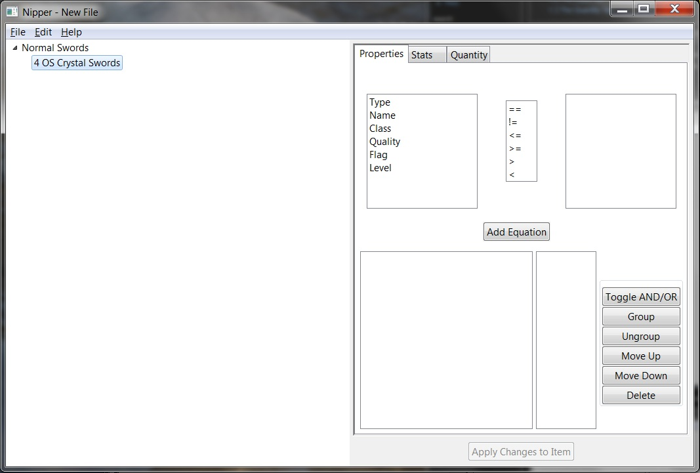

* Select Valid Properties

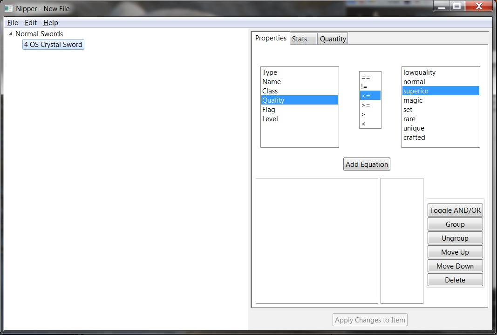

* Add Equation

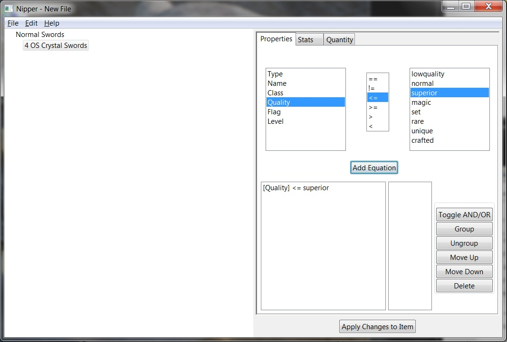

* Equation Added
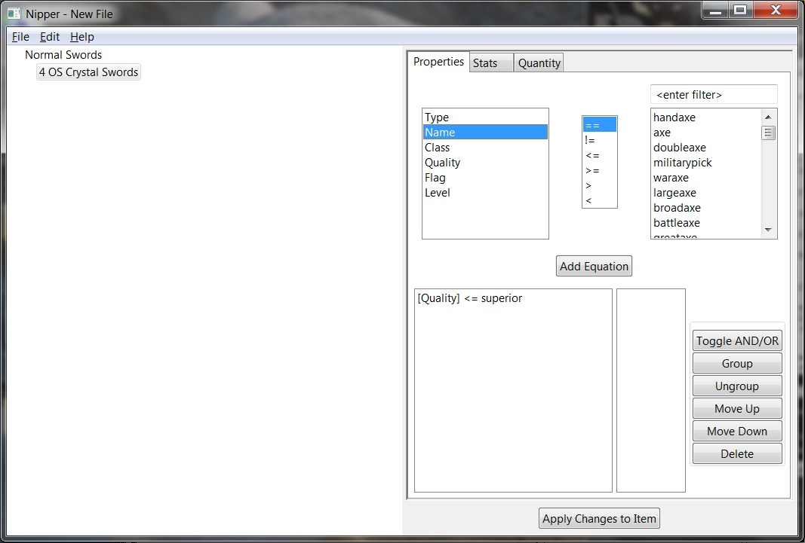

* Text Search


* Add Equation

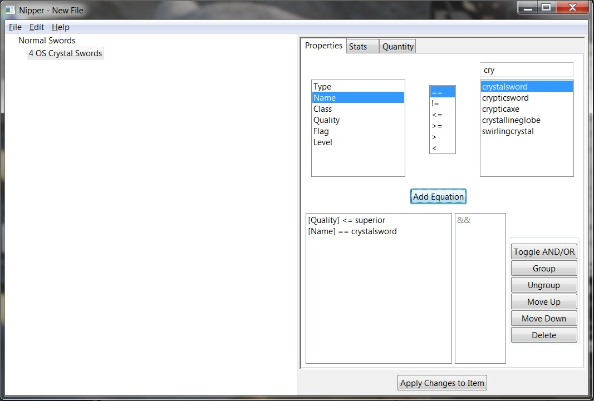

###### The Stats Tab

The stats tab contains all item stats associated with your item. The valid stats of an item consist of a very long list ot possible stats. With the some exceptions like sockets, the stats are mostly those item identifiers that do not appear on an item until the item is identified.

Use the filter box to assist in locating the stat you are looking for. You can enter any part of a search word to gain results.

Make your selections and add the equation to your list.

If you add multiple equations and wish any of that logic to be OR'ed instead of the default AND'ing, use the Toggle AND/OR button. If you desire groupings to describe and order of operations to your logic (i.e. parantheticals) use the Group/Ungroup buttons. You can also move equations up and down in the list or delete them altogether.

* Possible Stats

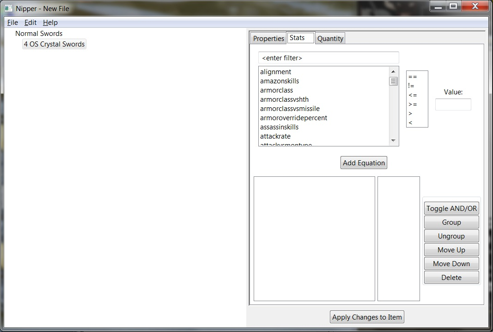

* Search For Stats

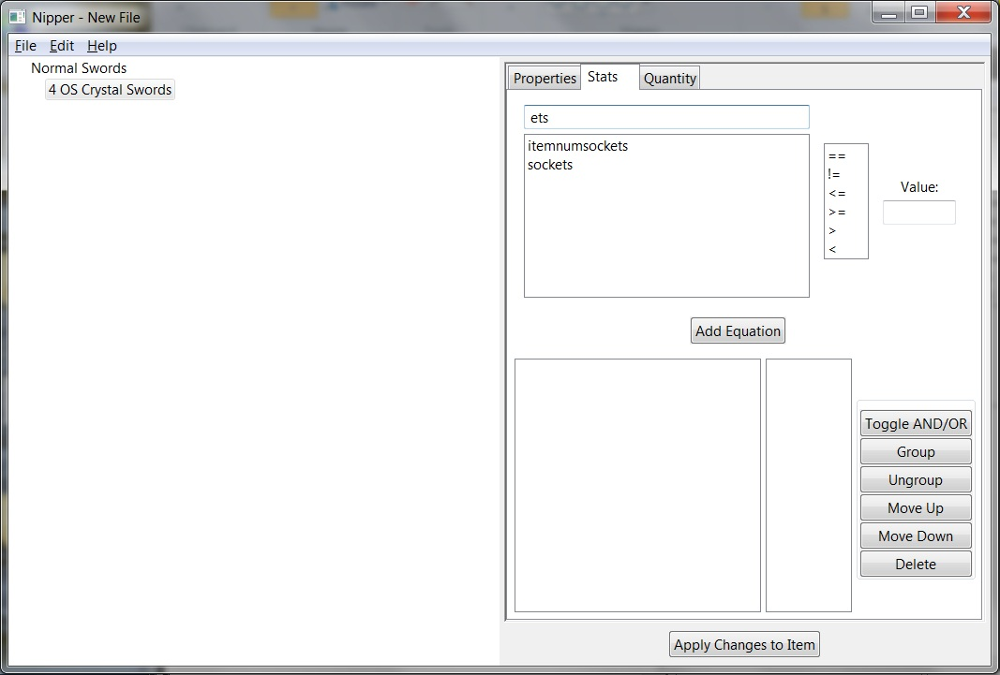

* Add Equation

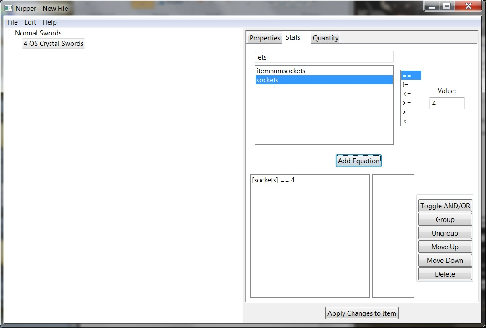

###### The Quantity Tab

The quantity tab allows you to constrain the number of these items kept by the bot. You can keep as many as you find or limit the amount retained to a specific number.


#### Edit Menu[/INDENT]

###### Edit Complex Keywords

This menu selection is only for advanced Nipper users.

The purpose of the complex keywords is to allow the user to add mathematical expressions to their NIP lines.

Add the new mathematical equation (complex keyword) in the complex keyword editor as shown in the first image below.

Locate your newly added keyword in the same place as all the other keywords, on the stats tab.

* Complex Equation

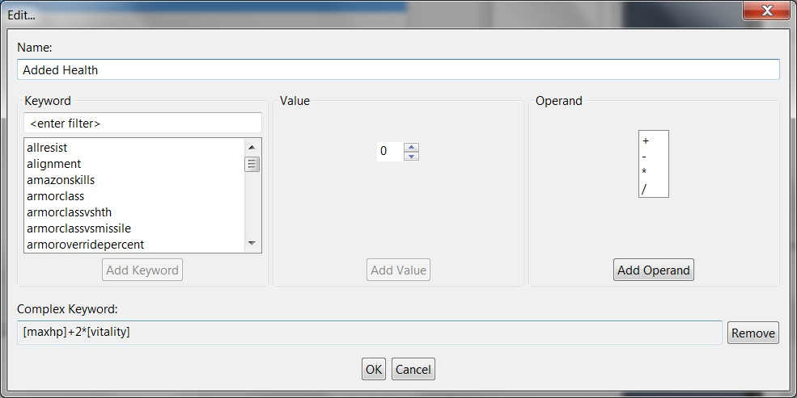

* New Keyword

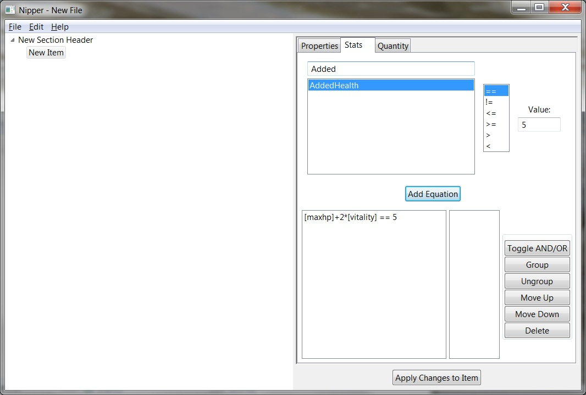

##### hystory

[bh shared topic](https://web.archive.org/web/20161029231618/http://www.blizzhackers.cc:80/viewtopic.php?f=182&t=495003)

and it was also included in etal d2nt bot.