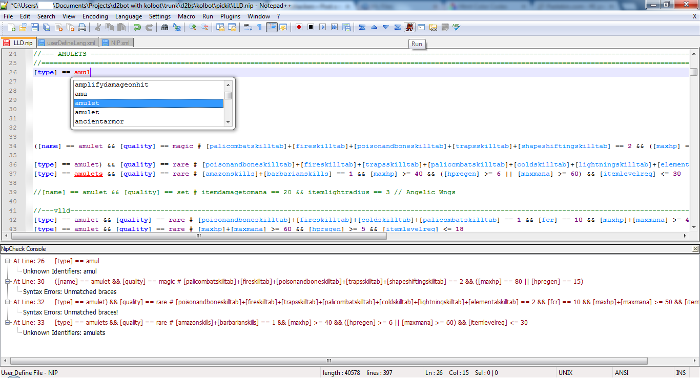
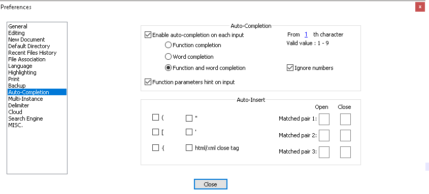

[pickit table of content](https://github.com/blizzhackers/pickits/#pickits)

[Nipper](https://github.com/blizzhackers/pickits/nipper/readme.md)

---

# NipCheck
by [@noah-](https://github.com/noah-)

### features

* detect and report syntax errors. Detect and report unknown keywords. Fully offline checker, no need to run d2bs.
* auto-complete Syntax Highlighting
* all unrecognized syntax will show up as red text with underline.

### download

* <https://github.com/noah-/NipCheck/archive/master.zip>

### download includes

* NipCheck.dll
* NIP.xml
* userDefineLanguage.xml

### installation

1. extract NipCheck.dll in a new created subfolder ...\Notepad++\plugins\NipCheck\

1. extract NIP.xml in ...\Notepad++\plugins\APIs\

1. extract userDefineLang.xml in C:\Users\<your user>\AppData\Roaming\Notepad++\

AppData is sometimes a hidden folder so make sure to have hidden folders shown. 
\* if there isn't a Notepad++ folder in C:\Users\<your user>\AppData\Roaming\ , extract userDefineLang.xml in \Notepad++\plugins\APIs\

### check settings

Once you open Notepad++, go to Settings > Preferences... and set the following settings to see auto-complete:


### using NipCheck

Open a nip file in np++. Go to Plugins > NipCheck > Run. Alternative way to start it is to use the diablo 2 icon on your np++ commands bar.
If NipCheck plugin isn't listed, that can happen after you upgrade np++ to a newer version, go to > Settings > Import pluging(s)... and browse to the NipCheck.dll, restart np++ and it's ok.

Here is an image showing auto-complete, syntax highlighting, and error checking:


### known bugs

In case of expressions **plusmaxdamage** and **plusskillferalrage** NipCheck will show:
```
Syntax Errors: Argument invalid in ArithmeticOperator.Eval - Invalid Expression: lhs
```
NIP.xml doesn’t include **plusmaxdamage**, but even if you add it, maybe an additional entry should be added in NipCheck.dll.

Also expression **tier**, used in autobuild **xpac.nip** files isn't included.

### history

* [initial shared topic](https://web.archive.org/web/20180324041959/http://www.blizzhackers.cc:80/viewtopic.php?f=182&t=495129)
